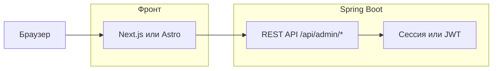

# План: гибридная админка (Next.js) — реализовано

> Thymeleaf-админка удалена. Работает только новая админка на Next.js (admin-ui).

## Цель

Переписать веб-админку с Thymeleaf на современный фронтенд (Next.js или Astro), оставив Spring Boot бэкендом в виде **REST API**. Логика и данные остаются в Java; UI — отдельное приложение.

---

## Выбор фреймворка

| Критерий | Next.js | Astro |
|----------|---------|--------|
| Стек | React, полный SPA/SSR | HTML-first, островки React/Vue при необходимости |
| Сложность | Выше, больше возможностей | Ниже, меньше бойлерплейта |
| Формы и интерактив | Везде React | Можно только на нужных страницах |
| Роутинг, данные | Встроенный, fetch/SWR | Страницы + островки, fetch |
| Сборка и деплой | `next build`, Node или статика | `astro build`, в основном статика |

**Рекомендация:** для админки с формами (игроки, матчи, долги, настройки) удобнее **Next.js**: единая модель (React + API), проще состояние и навигация. **Astro** имеет смысл, если хочется минимального JS и максимальной простоты страниц с «островками» интерактива.

---

## Архитектура (гибрид)

- **Spring Boot:** только REST API под префиксом `/api/admin` (или `/admin/api`). Текущий `AdminController` переписывается в `AdminApiController` (возврат JSON вместо имён шаблонов). Авторизация: либо cookie-сессия (если фронт на том же домене/порте), либо JWT.
- **Фронт (Next.js или Astro):** отдельное приложение; запросы к бэкенду через `fetch`/axios на URL Spring (например `http://localhost:8095` при разработке). Сборка: статические файлы или Node-сервер.
- **Деплой:**
  - **Вариант A (два сервиса):** фронт на своём порту/домене (или статика на nginx/CDN), бэкенд на 8095; CORS настроить на Spring.
  - **Вариант B (один сервер):** Spring отдаёт собранный фронт с `/**` (или `/admin`) и проксирует `/api/admin` в свои контроллеры; один порт.

---

## Шаги миграции

### 1. Бэкенд: REST API для админки

- Добавить в Spring новый контроллер (например `AdminApiController`) с эндпоинтами, возвращающими JSON:
  - `GET /api/admin/me` или контекст (текущая команда, список команд для выбора).
  - `GET/POST /api/admin/team-select` (текущая команда в сессии).
  - Игроки: `GET /api/admin/players`, `POST /api/admin/players`, `GET/PUT/DELETE /api/admin/players/{id}`.
  - Матчи: `GET /api/admin/matches`, `POST /api/admin/matches`, `GET/PUT /api/admin/matches/{id}`, `POST /api/admin/matches/{id}/result`, `POST /api/admin/matches/{id}/cancel`, `GET /api/admin/matches/{id}/card`, `POST /api/admin/matches/{id}/send-to-channel`.
  - Долги: `GET /api/admin/debt`, `POST /api/admin/debt`, `POST /api/admin/debt/paid/{playerId}`.
  - Настройки: `GET/POST /api/admin/settings` (канал).
  - Дашборд: `GET /api/admin/dashboard` (сводка: игроки, ближайший матч, долги).
- Авторизация: оставить форму логина на Spring (редирект на страницу логина при 401) или вынести логин на фронт и выдавать JWT/cookie с бэкенда.
- Сессия: хранить `adminTeamId` в сессии (как сейчас) и читать в API по cookie.

### 2. Фронт: новый проект

- Создать проект в папке, например `admin-ui/` (Next.js: `npx create-next-app@latest`, Astro: `npm create astro@latest`).
- Настроить базовый URL API (env: `NEXT_PUBLIC_API_URL` или `PUBLIC_API_URL` для Astro).
- Реализовать логин (форма → POST на бэкенд, сохранение cookie/токена).
- Реализовать выбор команды (если не в сессии — запрос к API, затем сохранение в контексте/state).
- Страницы: дашборд, состав (список + форма добавления/редактирования), матчи (список + формы + результат + карточка и «Отправить в Telegram»), долги, настройки.
- Для картинки матча: ссылка на `GET /api/admin/matches/{id}/card` (или прокси через бэкенд).

### 3. Авторизация и CORS

- Если фронт на другом порту: включить CORS в Spring для `http://localhost:3000` (или домена фронта), credentials: true для cookie.
- Логин: POST на Spring (например `/admin/login` или `/api/admin/login`), установка cookie; дальше все запросы с `credentials: 'include'`.

### 4. Удаление Thymeleaf-админки (после переноса)

- Удалить или отключить маршруты `AdminController` (Thymeleaf), оставить только API.
- Страницу логина можно оставить на Spring (редирект с API при 401) или перенести на фронт.

### 5. Деплой

- **Вариант A:** фронт собирается в `admin-ui/out` (Astro) или `admin-ui/build` (Next); при деплое раздаётся nginx или тем же Spring (статика из `src/main/resources/static` после копирования сборки).
- **Вариант B:** в production один домен: все запросы к `/admin` и статике фронта отдаёт один сервер (Spring или обратный прокси), `/api/admin` — только Spring.

---

## Проверка новой админки

1. **Запуск в Docker:**  
   `docker compose up -d`  
   - API: http://localhost:8095  
   - Админка (Next.js): http://localhost:3000  

2. **Редирект со старого URL:**  
   Открытие http://localhost:8095/admin (или /admin/...) перенаправляет на http://localhost:3000 (задаётся в `app.admin-ui-url`, по умолчанию `http://localhost:3000`).

3. **Вход и сценарий:**  
   - Открыть http://localhost:3000 → редирект на /login.  
   - Логин/пароль из конфига (`admin.username`, `admin.password`, по умолчанию **admin** / **admin**).  
   - После входа — выбор команды (если не выбрана), затем дашборд, состав, матчи, долги, настройки.

4. **Почему не получалось войти (исправлено):**  
   Запросы с фронта (localhost:3000) на API (localhost:8095) — разные origin, браузер не отправлял куку сессии. Сделано: (1) запросы идут на тот же origin через **прокси** в Next.js (`/api/*` → бэкенд); (2) в Spring для cross-origin добавлена кука сессии `SameSite=None` (в production включить `SESSION_COOKIE_SECURE=true` при HTTPS).

5. **Сборка образов:**  
   `docker compose build app admin-ui` — успешная сборка подтверждает, что бэкенд и фронт собираются без ошибок.

6. **Если приложение не стартует (контейнер app падает):**  
   В логах может быть `TelegramApiErrorResponseException: 401` — неверный или истёкший токен бота. Задай корректный `TELEGRAM_BOT_TOKEN` в `.env` или в окружении и перезапусти. Пока контейнер app падает, админка по 3000 недоступна (прокси не может достучаться до бэкенда).

7. **Если не входится в админку (Неверный логин или пароль):**  
   Логин/пароль по умолчанию: **admin** / **admin**. В логах контейнера app при неудачном входе будет строка `Login failed for user: ...` — по ней видно, какой логин пришёл и тип ошибки. Проверь, что в docker-compose для сервиса `app` заданы `ADMIN_USERNAME` и `ADMIN_PASSWORD` (или используются значения по умолчанию из `.env`).

---

## Итог

- **Гибрид:** бэкенд Spring Boot (REST API + авторизация), фронт — отдельное приложение (Next.js).
- **Рекомендация по фреймворку:** Next.js для единообразного интерактива и форм; Astro — если приоритет минимального JS и простоты.
- Дальнейшие шаги: спроектировать точный список DTO и эндпоинтов API, затем по очереди реализовать API и экраны фронта.

Если скажешь, выбран ли Next.js или Astro и деплой (один сервер или два), можно расписать конкретные эндпоинты и структуру папок фронта.
